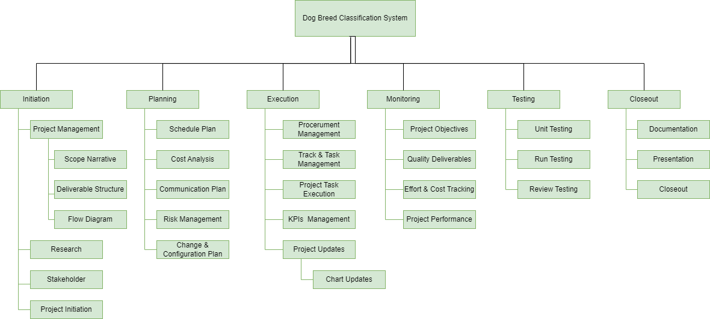
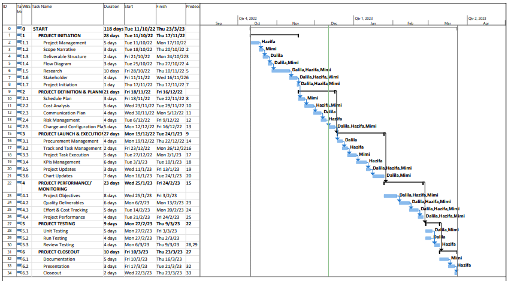
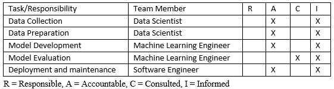

# PROJECT OVERVIEW

## B. PLANNING THE PROJECT

### Project Management Life-Cycle

+ WBS

+ Gantt Chart

### Risk Identification Chart

| Control Element | What is likely to go wrong? | How and when will I know? | What will I do about it? |
|-----|----|-------|-----|
|Quality   (Poor attitude toward quality; substandard design, materials, and workmanship; inadequate quality assurance program)|1. Inadequate Quality Assurance Program: The system confused the dog breed class   (Ex. Siberian Husky and Alaskan Malamutes)    2. Inadequate Quality Assurance Program: The quality of the AI model is biased towards a certain dog breed.  |How: The output result always segmented the wrong breed of the dog     When: The quality problem of will be determined during the unit testing phase|Assign one member to keep on collecting the data day to day and increased the dataset until a satisfied result is determined.|
|Cost   (Estimating errors; inadequate productivity, cost, change, or contingency)|1. Contigency: The costing of the server will be spike if one of the developer forget to shutdown the EC2 instance when not using it. |How: The monthly bills shows unexpected extra charged to the bills.  When: The problem most probably will be encountered during the project execution and project implementation.|Notify the owner through email or discord whenever budget exceed threshold in the AWS cloud computing service.
|Time   (Errors in estimating time or resource availability; errors in determining the critical path; poor allocation and management of float; early release of competitive products) | 1. Project not able to reach the milestone set  as described in the Gantt Chart.    2. Erros in estimating resource availability: There are not enough server to be used to run the dog breed classification model training  |How: The members are stuck with a certain problem and drag all the other team members    When: The problem will be encountered during the project excution and monitoring phase.| Ask support from the other team member and switch their task or job to other job to avoid him/her to stuck in the problem loop.|

### Responsibility Assignment Matrices (RAM) 

+ Responsibility Assignment Matrices (RAM) Table

+ Roles and Responsibility

|Roles|
 Person In Charge 
|Responsibilities|
|:-----:|:------:|------|
| Project Manager | NorHazifa | Responsible for overall project coordination, managing the project timeline and budget, and communicating project status to stakeholders.|
| Data Scientist | Nurul Syammimi | Responsible for collecting and preparing the dataset of labeled dog images that will be used to train the model. This may include tasks such as acquiring the images, cleaning and formatting the data, and dividing the data into training, validation, and test sets.
| Machine Learning Engineer | Nurul Dalila | Responsible for developing and training the model to classify dog breeds. This may include tasks such as selecting a pre-trained model to fine-tune, designing a custom CNN architecture or using Transfer learning techniques.
| Software Engineer | Nurul Syammimi | Responsible for deploying the model to a production environment, and maintaining and updating the system over time. This may include tasks such as hosting the model, monitoring its performance, and making updates and improvements as needed.|
| Quality Assurance Engineer | Nurul Dalila | Responsible for testing the system and ensuring that it meets the desired performance and quality standards|
| Business Analyst | NorHazifa | Works with stakeholders to understand and analyze the business requirements that the dog breed classification system needs to meet. |

   
##### Next: [Project Implementation](C-PROJECT_IMPLEMENTATION.md)
