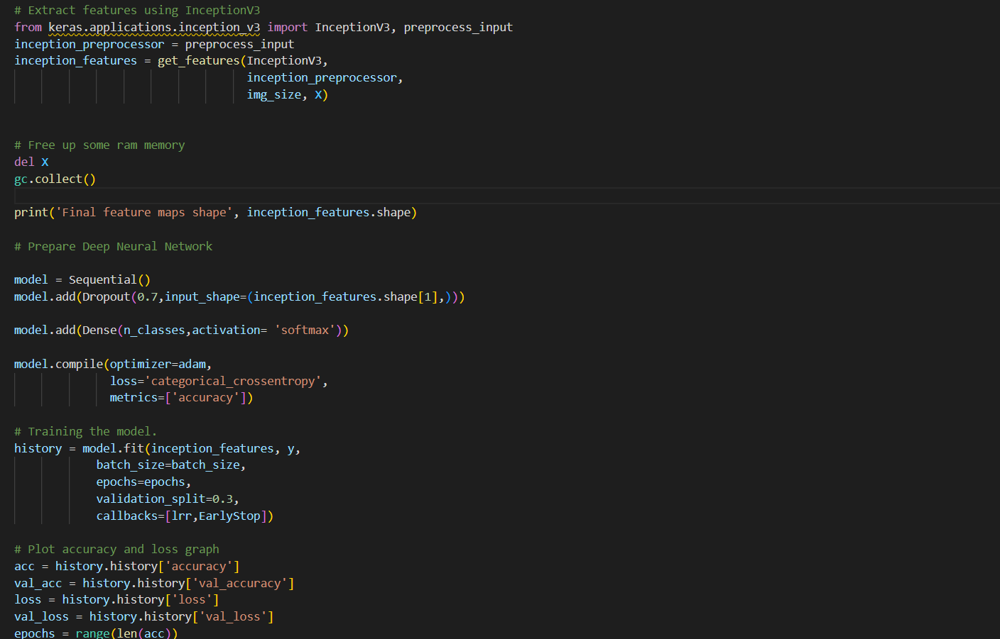

# PROJECT OVERVIEW

## EXECUTING THE PROJECT

### Design/Diagrams

+ Flowchart

+ Dog Breed Classification Algorithm

### Coding
+ Pre-process Data

+ Inception V3

+ Testing

### Output

+ Upload image into system'

+ Classification result

   
##### Next: [Project Closing](E-PROJECT_CLOSING.md)
